# Decorations

**Categories:** Interactable Objects · **Source:** [Fandom](https://thelongdark.fandom.com/wiki/Decorations)

**Contents**

- [Limitations](#limitations)
- [Craftable Decorations](#craftable-decorations)
- [Anywhere](#anywhere)
- [Work Bench](#work-bench)
- [Furniture Workbench](#furniture-workbench)
- [Lootable Decorations](#lootable-decorations)
- [Destroyable Decorations](#destroyable-decorations)

_A [Safehouse](./Safehouse.md) before decorating_

_A Safehouse after being decorated_

**Decorations** is a section of the Backpack in the [Survival Menu](./Survival%20Menu.md) that contains all items that can be carried around and placed inside an interior as part of the [Safehouse Customization](./Safehouse%20Customization.md) feature. It was added as part of a free update for [Tales from the Far Territory](./Tales%20from%20the%20Far%20Territory.md) Part 6: Broken Silence.

## Limitations

Some Decorations have limitations on where they can be placed.

- Some items can only be placed on walls (mirrors, [First Aid Kit](./First%20Aid%20Kit.md), [Medicine Shelf](./Medicine%20Shelf.md)).
- Most items can only be placed on the floor or on top of other objects.
- Computer Monitors that contain [Buffer Memories](./Buffer%20Memories.md) cannot be picked up.
- All Decorations that can be carried have weight and a unique icon.
  - If these items are dropped on the ground, a [Safehouse Decoration Box](./Safehouse%20Decoration%20Box.md) is produced to contain them, with each box having 100.00 kg of space.
  - Very large furniture decorations created at a [Furniture Workbench](./Furniture%20Workbench.md) cannot be carried around (despite having weight) and can only be harvested to partially regain materials once they are created (or they can be outright destroyed as usual).

## Craftable Decorations

These Decorations can be [Crafted](./Crafting.md) with the aid of [Woodworking Tools](./Woodworking%20Tools.md) (except for [Bear Hide Rug](./Bear%20Hide%20Rug.md)).

### Anywhere

Recipe

Materials

Time

Weight

Crafted

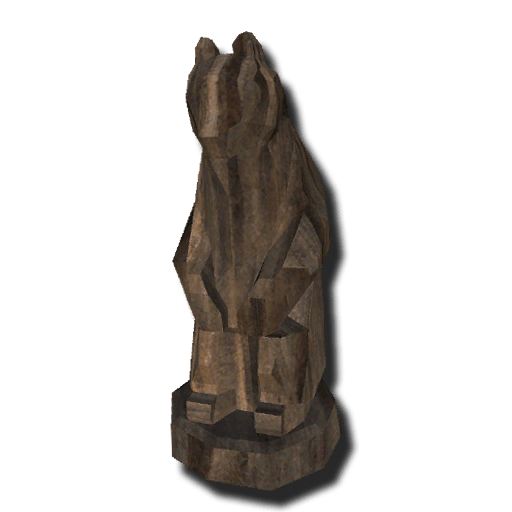 [Carved Bear Figurine](./Carved%20Bear%20Figurine.md)

1x  [Cedar Firewood](./Cedar%20Firewood.md)

4 Hours

0.25 kg / _(0.55 lb)_

Anywhere

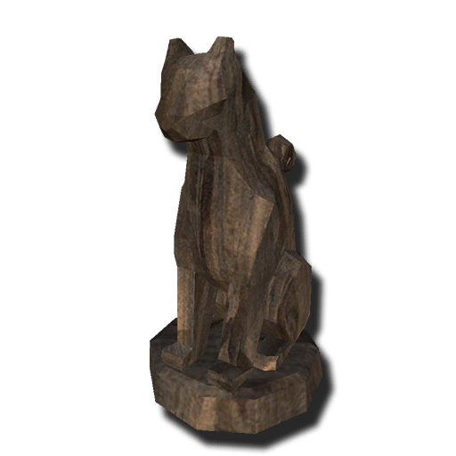 [Carved Cougar Figurine](./Carved%20Cougar%20Figurine.md)

1x  [Cedar Firewood](./Cedar%20Firewood.md)

4 Hours

0.25 kg / _(0.55 lb)_

Anywhere

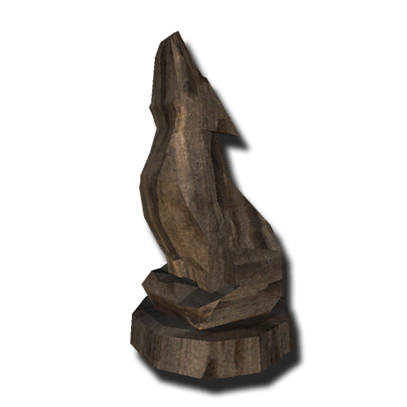 [Carved Wolf Figurine](./Carved%20Wolf%20Figurine.md)

1x  [Cedar Firewood](./Cedar%20Firewood.md)

4 Hours

0.25 kg / _(0.55 lb)_

Anywhere

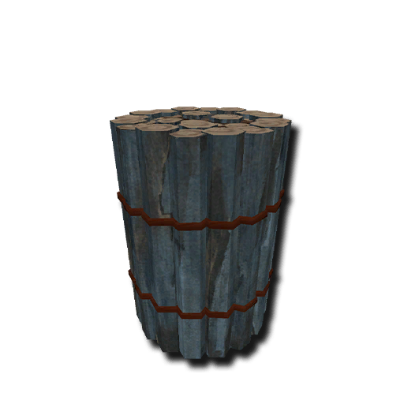 [Decorative End Table](./Decorative%20End%20Table.md)

6x  [Cedar Firewood](./Cedar%20Firewood.md)

5 Hours

2.00 kg / _(4.4 lb)_

Anywhere

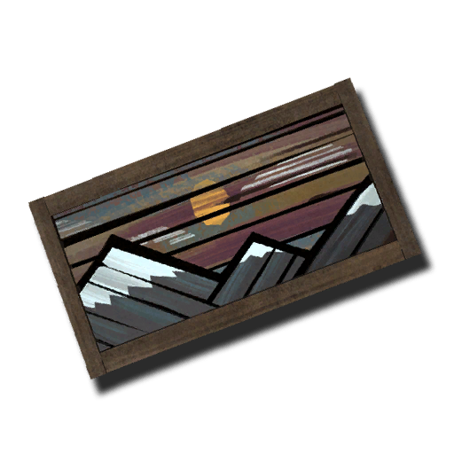 [Decorative Art](./Decorative%20Art.md)

2x  [Fir Firewood](./Fir%20Firewood.md) 1x  [Cedar Firewood](./Cedar%20Firewood.md) / 1x  [Reclaimed Wood](./Reclaimed%20Wood.md)

5 Hours

1.00 kg / _(2.2 lb)_

Anywhere

 [Decorative Art (2)](./Decorative%20Art%20%282%29.md)

2x  [Fir Firewood](./Fir%20Firewood.md) 1x  [Cedar Firewood](./Cedar%20Firewood.md) / 1x  [Reclaimed Wood](./Reclaimed%20Wood.md)

5 Hours

1.00 kg / _(2.2 lb)_

Anywhere

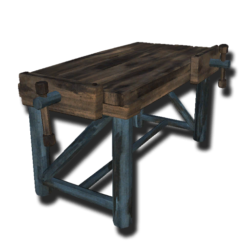 [Furniture Workbench](./Furniture%20Workbench.md)

10x  [Cedar Firewood](./Cedar%20Firewood.md)

4 Hours

15.00 kg / _(33 lb)_

Anywhere

### Work Bench

Recipe

Materials

Time

Weight

Crafted

 [Bear Hide Rug](./Bear%20Hide%20Rug.md)

1x [Cured Deer Hide](./Cured%20Deer%20Hide.md) 1x [Cured Black Bear Hide](./Cured%20Black%20Bear%20Hide.md) / 2x [Cured Gut](./Cured%20Gut.md)

8 Hours

12.00 kg / _(26.4 lb)_

[Work Bench](./Work%20Bench.md)

### Furniture Workbench

Once crafted, the following Decorations crafted at a Furniture Workbench will be placed in a container in that Workbench (they can be placed your Safehouse by opening the Furniture Workbench and selecting them). They cannot be placed in the player's inventory despite having a weight class, and furniture with containers cannot be broken down to regain some of their resources once placed in the Safehouse.

Recipe

Materials

Time

Weight

Crafted

 [Bear Hide Bed](./Bear%20Hide%20Bed.md)

18x  [Fir Firewood](./Fir%20Firewood.md) 4x [Cured Gut](./Cured%20Gut.md) / 1x  [Cured Black Bear Hide](./Cured%20Black%20Bear%20Hide.md) / 16x  [Ptarmigan Down](./Ptarmigan%20Down.md)

24 Hours

10.00 kg / _(22 lb)_

[Furniture Workbench](./Furniture%20Workbench.md)

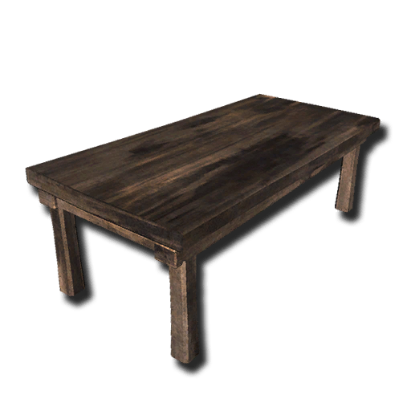 [Coffee Table](./Coffee%20Table.md)

6x  [Fir Firewood](./Fir%20Firewood.md)

4 Hours

5.00 kg / _(11 lb)_

[Furniture Workbench](./Furniture%20Workbench.md)

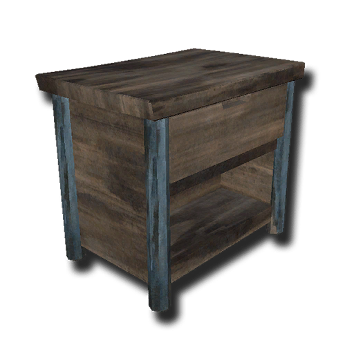 [Rustic End Table](./Rustic%20End%20Table.md)

6x  [Cedar Firewood](./Cedar%20Firewood.md) 2x  [Reclaimed Wood](./Reclaimed%20Wood.md)

6 Hours

20.00 kg / _(44 lb)_

[Furniture Workbench](./Furniture%20Workbench.md)

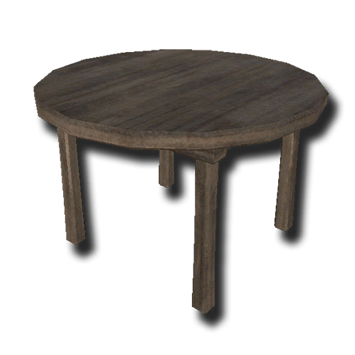 [Round Table](./Round%20Table.md)

12x  [Fir Firewood](./Fir%20Firewood.md)

9 Hours

5.00 kg / _(11 lb)_

[Furniture Workbench](./Furniture%20Workbench.md)

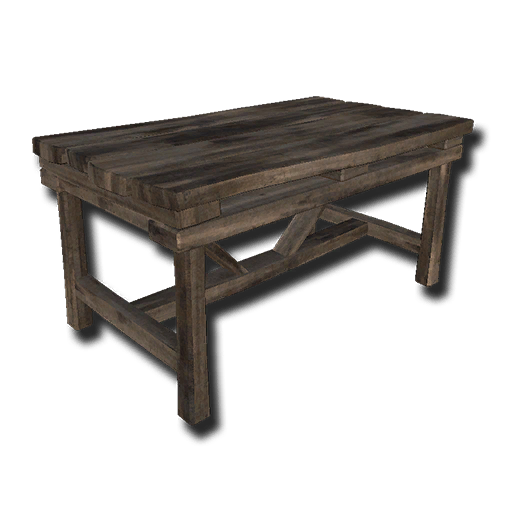 [Rustic Table](./Rustic%20Table.md)

10x  [Fir Firewood](./Fir%20Firewood.md)

8 Hours

8.00 kg / _(17.6 lb)_

[Furniture Workbench](./Furniture%20Workbench.md)

 [Square Table](./Square%20Table.md)

8x  [Fir Firewood](./Fir%20Firewood.md)

7 Hours

5.00 kg / _(11 lb)_

[Furniture Workbench](./Furniture%20Workbench.md)

\[Missing image: \[\[File:Rustic\_Chair\_icon.png\] [Rustic Chair](./Rustic%20Chair.md) / `icon.png\|link=`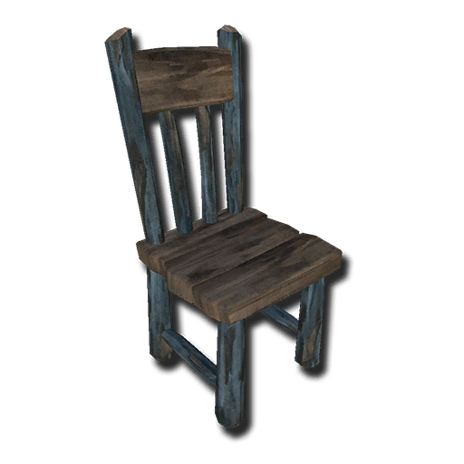[`Rustic Chair`](./Rustic%20Chair.md)

29x29px\]\] link=Rustic Chair\|29x29px [Rustic Chair](./Rustic%20Chair.md)

 [Rustic Chair](./Rustic%20Chair.md) \]\]

Recipe

Materials

Time

Weight

Crafted

 [Framed Hockey Jersey](./Framed%20Hockey%20Jersey.md)

2x  [Fir Firewood](./Fir%20Firewood.md) 1x  [Scrap Metal](./Scrap%20Metal.md) / 1x  [Hockey Jersey](./Hockey%20Jersey.md)

4 Hours

2.00 kg / _(4.4 lb)_

[Furniture Workbench](./Furniture%20Workbench.md)

 [Framed Photo](./Framed%20Photo.md)

1x  [Fir Firewood](./Fir%20Firewood.md) 1x 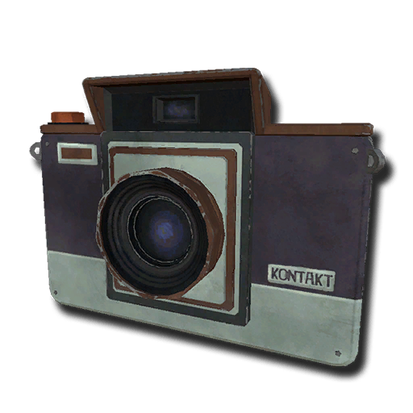 [Camera](./Camera.md) Photo

2 Hours

0.25 kg / _(0.55 lb)_

[Furniture Workbench](./Furniture%20Workbench.md)

 [Mounted Burbot](./Mounted%20Burbot.md)

1x  [Fir Firewood](./Fir%20Firewood.md) 1x  [Burbot (Raw)](./Burbot%20%28Raw%29.md)

4 Hours

0.50 kg / _(1.1 lb)_

[Furniture Workbench](./Furniture%20Workbench.md)

 [Mounted Coho Salmon](./Mounted%20Coho%20Salmon.md)

1x  [Fir Firewood](./Fir%20Firewood.md) 1x  [Coho Salmon (Raw)](./Coho%20Salmon%20%28Raw%29.md)

4 Hours

1.00 kg / _(2.2 lb)_

[Furniture Workbench](./Furniture%20Workbench.md)

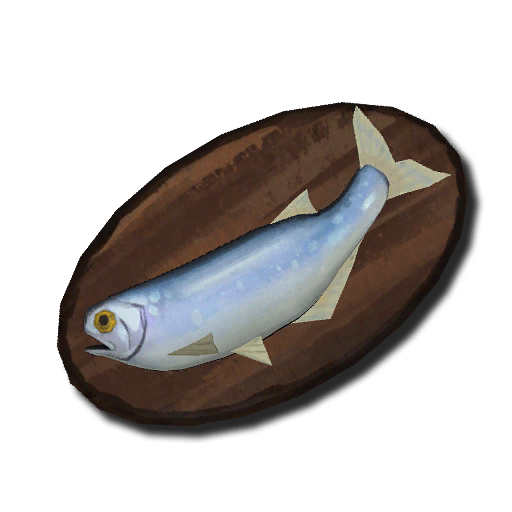 [Mounted Goldeye](./Mounted%20Goldeye.md)

1x  [Fir Firewood](./Fir%20Firewood.md) 1x  [Goldeye (Raw)](./Goldeye%20%28Raw%29.md)

4 Hours

0.50 kg / _(1.1 lb)_

[Furniture Workbench](./Furniture%20Workbench.md)

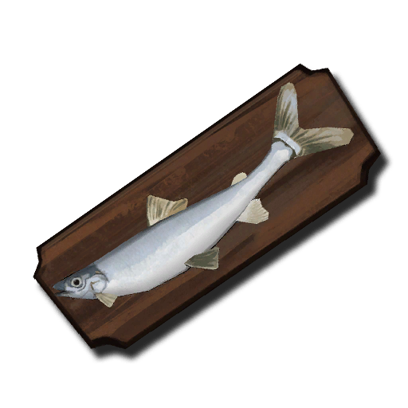 [Mounted Lake Whitefish](./Mounted%20Lake%20Whitefish.md)

1x  [Fir Firewood](./Fir%20Firewood.md) 1x  [Lake Whitefish (Raw)](./Lake%20Whitefish%20%28Raw%29.md)

4 Hours

0.50 kg / _(1.1 lb)_

[Furniture Workbench](./Furniture%20Workbench.md)

 [Mounted Rainbow Trout](./Mounted%20Rainbow%20Trout.md)

1x  [Fir Firewood](./Fir%20Firewood.md) 1x  [Rainbow Trout (Raw)](./Rainbow%20Trout%20%28Raw%29.md)

4 Hours

0.50 kg / _(1.1 lb)_

[Furniture Workbench](./Furniture%20Workbench.md)

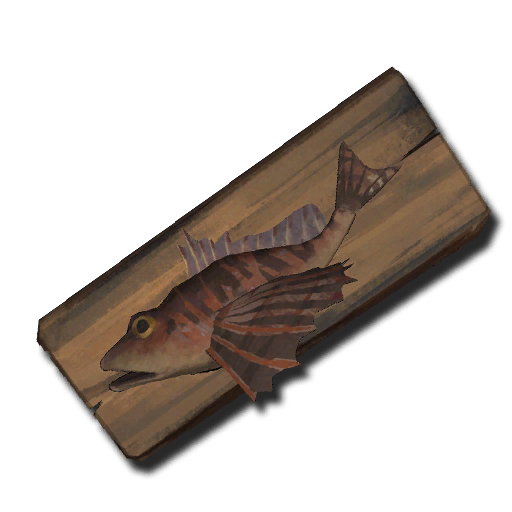 [Mounted Red Irish Lord](./Mounted%20Red%20Irish%20Lord.md)

1x  [Fir Firewood](./Fir%20Firewood.md) 1x  [Red Irish Lord (Raw)](./Red%20Irish%20Lord%20%28Raw%29.md)

4 Hours

0.50 kg / _(1.1 lb)_

[Furniture Workbench](./Furniture%20Workbench.md)

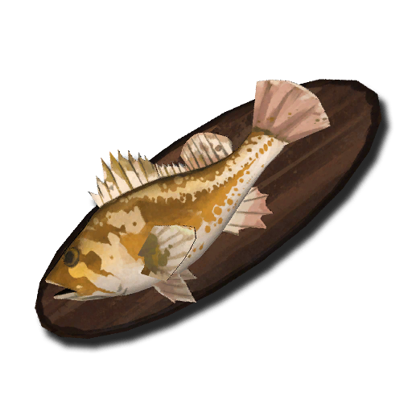 [Mounted Rockfish](./Mounted%20Rockfish.md)

1x  [Fir Firewood](./Fir%20Firewood.md) 1x  [Rockfish (Raw)](./Rockfish%20%28Raw%29.md)

4 Hours

0.50 kg / _(1.1 lb)_

[Furniture Workbench](./Furniture%20Workbench.md)

 [Mounted Smallmouth Bass](./Mounted%20Smallmouth%20Bass.md)

1x  [Fir Firewood](./Fir%20Firewood.md) 1x  [Smallmouth Bass (Raw)](./Smallmouth%20Bass%20%28Raw%29.md)

4 Hours

0.50 kg / _(1.1 lb)_

[Furniture Workbench](./Furniture%20Workbench.md)

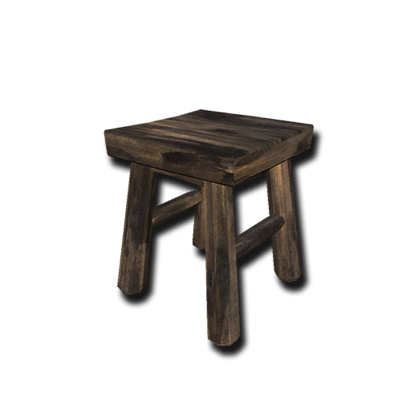 [Rustic Stool](./Rustic%20Stool.md)

4x  [Fir Firewood](./Fir%20Firewood.md)

2 Hours

2.00 kg / _(4.4 lb)_

[Furniture Workbench](./Furniture%20Workbench.md)

Icon

Name

Weight

Location Found

Banner

5.00 kg / _(11 lb)_

[St. Christopher's Church](./St.%20Christopher%27s%20Church.md), [Pleasant Valley Church](./Pleasant%20Valley%20Church.md)

_Baseball.png_

Baseball

0.05 kg / _(0.11 lb)_

[Blackrock Prison](./Blackrock%20Prison.md) Warden's Office, [Main Hangar](./Main%20Hangar.md) office (where [Stained Paper](./Stained%20Paper.md) is found)

_BaseballBat.png_

Baseball Bat

0.50 kg / _(1.1 lb)_

[Blackrock Prison](./Blackrock%20Prison.md) Warden's Office

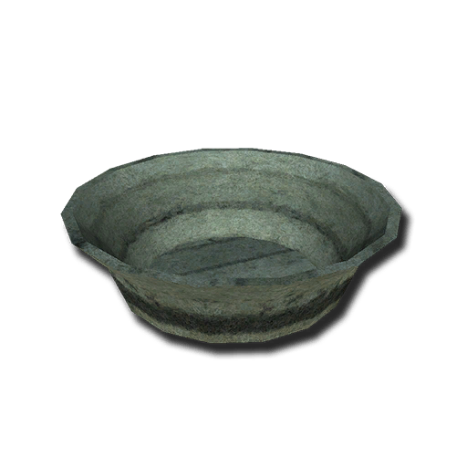

_Basin\_Decoration.png_

[Basin](./Basin.md)

2.00 kg / _(4.4 lb)_

[Quonset Garage](./Quonset%20Garage.md)

Basket

0.25 kg / _(0.55 lb)_

[Main Hangar](./Main%20Hangar.md), [Convenience Store](./Convenience%20Store.md), [Basement (Sundered Pass)](./Basement%20%28Sundered%20Pass%29.md)

_Blender.png_

Blender

0.25 kg / _(0.55 lb)_

Trailers, [Paradise Meadows Farm](./Paradise%20Meadows%20Farm.md), Houses

Bowl

0.05 kg / _(0.11 lb)_

Houses, Trailers

[Box](./Cardboard%20Box.md)

0.10 kg / _(0.22 lb)_

Houses, [Convenience Store](./Convenience%20Store.md), [Rural Store](./Rural%20Store.md), Trailers

_MetalFileCabinetDrawerA2.png_

Broken Drawer

1.00 kg / _(2.2 lb)_

Offices

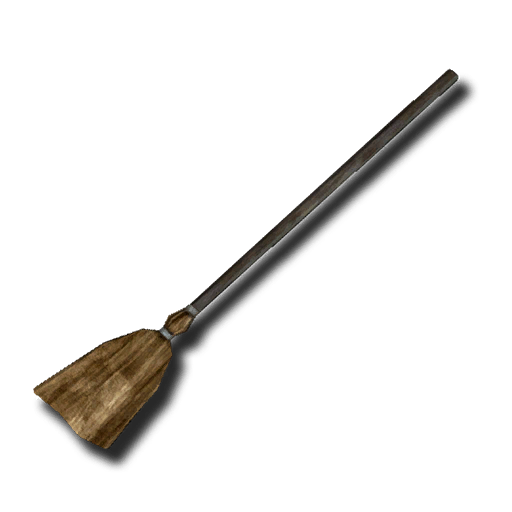

[Broom](./Broom.md)

0.20 kg / _(0.44 lb)_

Houses, Industrial Areas

_MetalBucketA.png_

[Bucket](./Metal%20Pail.md)

1.00 kg / _(2.2 lb)_

Houses, Industrial Areas

Bulletin Board

5.00 kg / _(11 lb)_

Industrial Areas

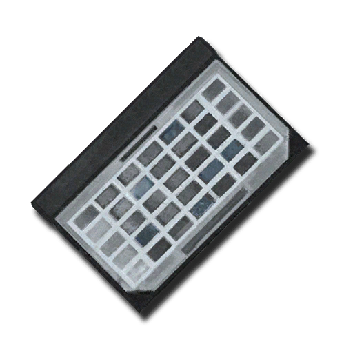

Calendar

0.10 kg / _(0.22 lb)_

Houses, Industrial Areas

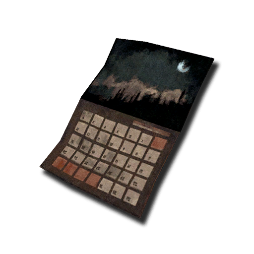

_VistaCalendar.png_

Calendar

0.25 kg / _(0.55 lb)_

Houses, Industrial Areas

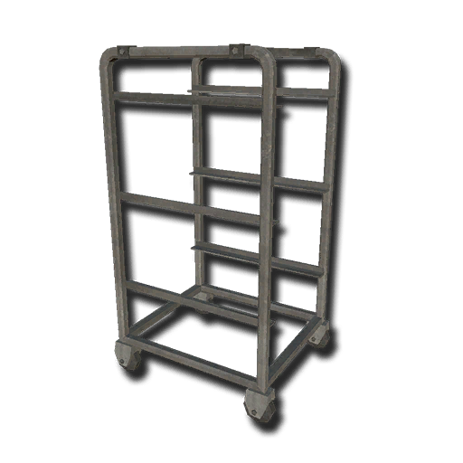

_Trolley\_A.png_

Cart

5.00 kg / _(11 lb)_

[Idle Camp](./Idle%20Camp.md) mess hall

_StereoCassetteTape.png_

Cassete

0.10 kg / _(0.22 lb)_

[Blackrock Prison](./Blackrock%20Prison.md) Warden's Office, [Cabin](./Cabin.md), [Carter Hydro Dam](./Carter%20Hydro%20Dam.md)

Chair

4.00 kg / _(8.8 lb)_

[Main Hangar](./Main%20Hangar.md), [Community Hall](./Community%20Hall.md), [Blackrock Prison](./Blackrock%20Prison.md) Offices/Infirmary

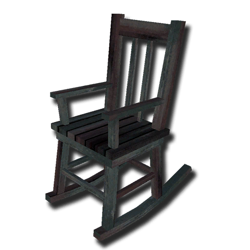

Chair

5.00 kg / _(11 lb)_

Houses, [Hunting Lodge](./Hunting%20Lodge.md), Metal chair [Blackrock Prison](./Blackrock%20Prison.md) (Infirmary),

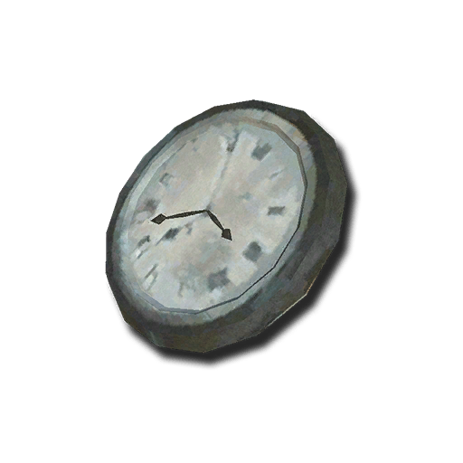

_WallClock.png_

Clock

1.00 kg / _(2.2 lb)_

Houses

Coffee Machine

0.50 kg / _(1.1 lb)_

Kitchens, Trailers, Cabins

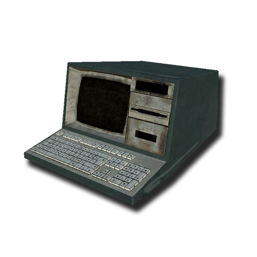

Computer

5.00 kg / _(11 lb)_

Industrial Areas

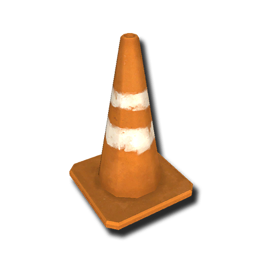

_Traffic\_Cone\_A.png_

Cone

0.25 kg / _(0.55 lb)_

[Main Hangar](./Main%20Hangar.md) (2 different cone models but display the same Backpack icon)

[Crate](./Crate.md)

0.30 kg / _(0.66 lb)_

Industrial Areas

_BabyCrib.png_

Crib

5.00 kg / _(11 lb)_

[Milton House](./Milton%20House.md) (house close to Grey Mother's leading to [Radio Tower](./Radio%20Tower.md))

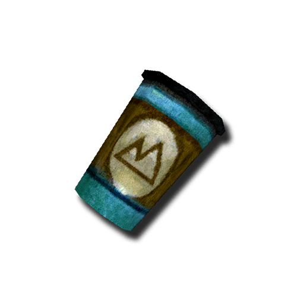

Cup

0.05 kg / _(0.11 lb)_

Houses, [Convenience Store](./Convenience%20Store.md)

_PaperCupA.png_

Cup

0.10 kg / _(0.22 lb)_

[Concentrator](./Concentrator.md), [Control Tower](./Control%20Tower.md)

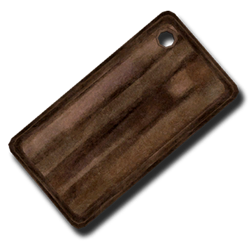

_CuttingBoardA.png_

Cutting Board

0.10 kg / _(0.22 lb)_

House Kitchens

_CuttingBoardB.png_

Cutting Board

0.25 kg / _(0.55 lb)_

House Kitchens

_DeerMount.png_

Deer Mount

5.00 kg / _(11 lb)_

[Hunting Lodge](./Hunting%20Lodge.md), Hunting [Prepper Cache](./Prepper%20Cache.md), Places with animal trophies

_ComputerFloppy.png_

Disk

0.02 kg / _(0.044 lb)_

Near Computers, [Maintenance Yard](./Maintenance%20Yard.md), [Carter Hydro Dam](./Carter%20Hydro%20Dam.md)

_DreamCatcher.png_

Dream Catcher

0.10 kg / _(0.22 lb)_

[Camp Office](./Camp%20Office.md), [Mindful Cabin](./Mindful%20Cabin.md), [Lake Cabins](./Lake%20Cabins.md), Cabin under [Abandoned Lookout](./Abandoned%20Lookout.md)

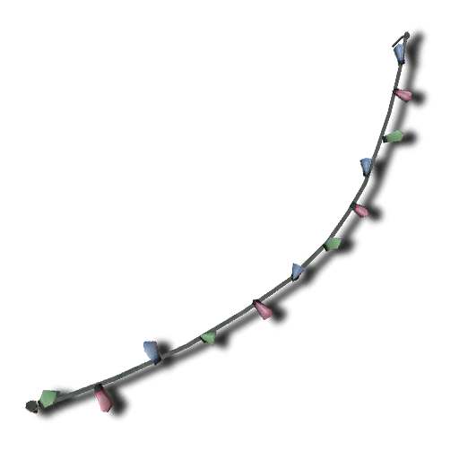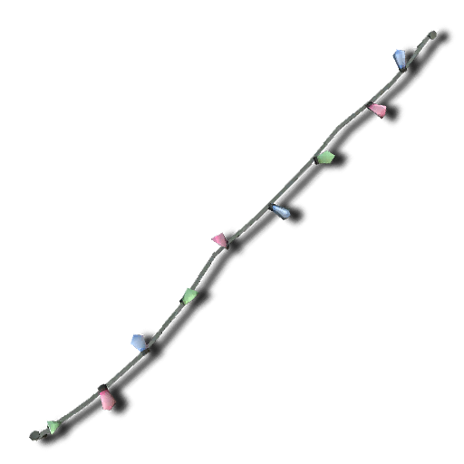

Festive Lights

0.25 kg / _(0.55 lb)_

[Hangar Basement](./Hangar%20Basement.md), [Community Hall](./Community%20Hall.md), [Carter Hydro Dam](./Carter%20Hydro%20Dam.md) (office stairwell), [Hunting Lodge](./Hunting%20Lodge.md) ([Festive Sweater](./Festive%20Sweater.md) is usually nearby)

Fish Mount

0.25 kg / _(0.55 lb)_

Cabins, [Hunting Lodge](./Hunting%20Lodge.md), [Maintenance Yard](./Maintenance%20Yard.md)

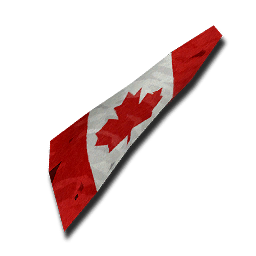

Flag

0.25 kg / _(0.55 lb)_

[Milton Post Office](./Milton%20Post%20Office.md), [Concentrator](./Concentrator.md) (7th Floor Offices) / Large flags on the [Maintenance Yard](./Maintenance%20Yard.md) Shed ceiling (can be reached in [Safe House Customization](./Safehouse%20Customization.md) with a plank), [Carter Hydro Dam](./Carter%20Hydro%20Dam.md) Turbine Room (can be reached in [Safe House Customization](./Safehouse%20Customization.md) with various stacked items, flag keeps "swaying" property when placed in new locations) / Small table flag in [Blackrock Prison](./Blackrock%20Prison.md) Warden's office

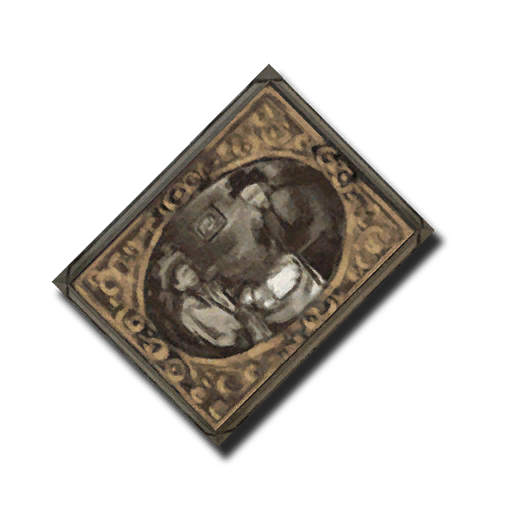

Frame

0.15 kg / _(0.33 lb)_

Houses

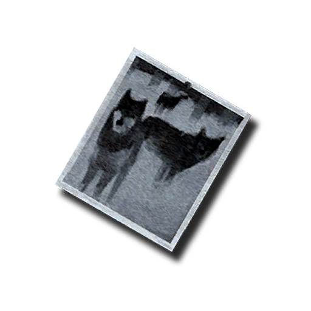

Frame (Table)

0.25 kg / _(0.55 lb)_

Houses (these are table picture frames)

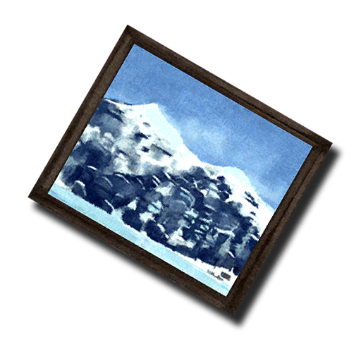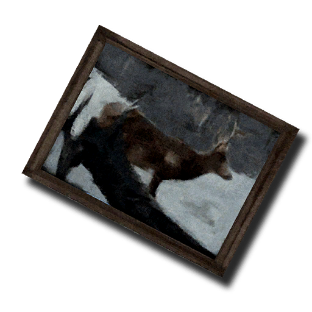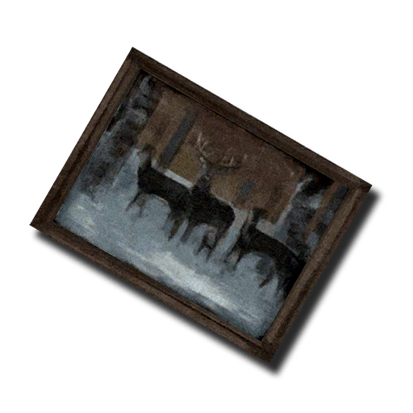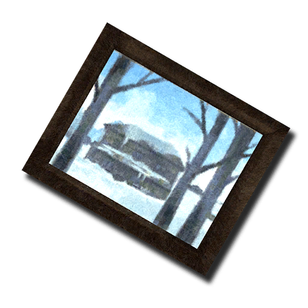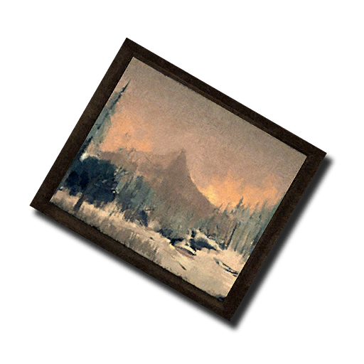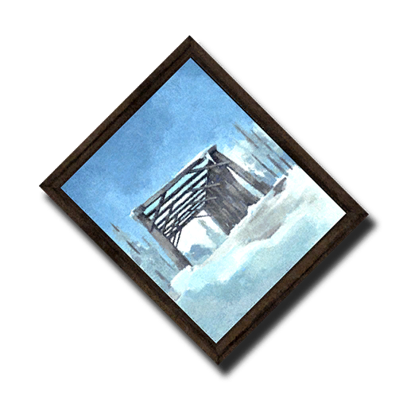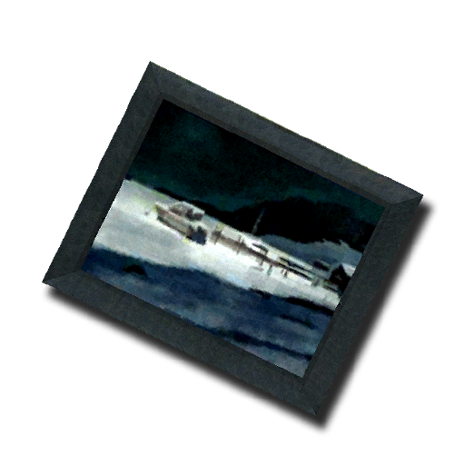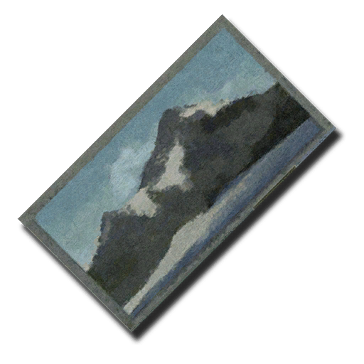

Frame

0.25 kg / _(0.55 lb)_

Houses

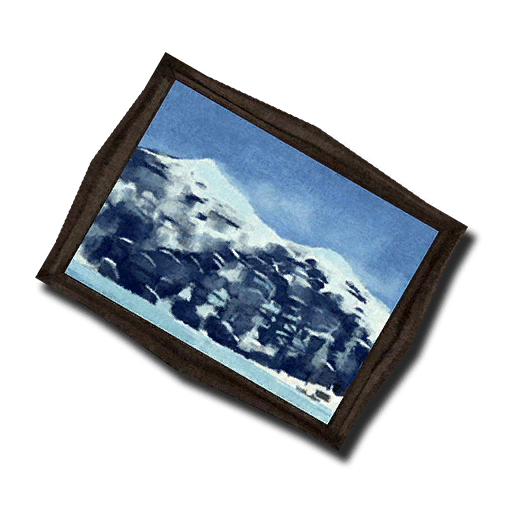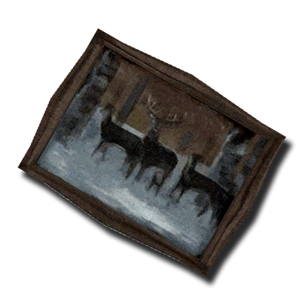

Frame (Frame 2)

0.25 kg / _(0.55 lb)_

Houses

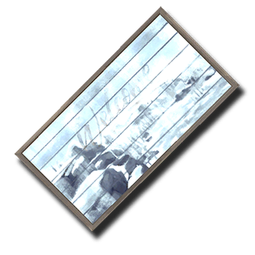

_PictureFrameWelcomeSign.png_

Frame

0.25 kg / _(0.55 lb)_

[Camp Office](./Camp%20Office.md) welcome sign

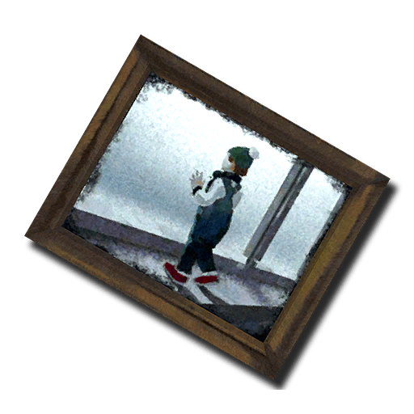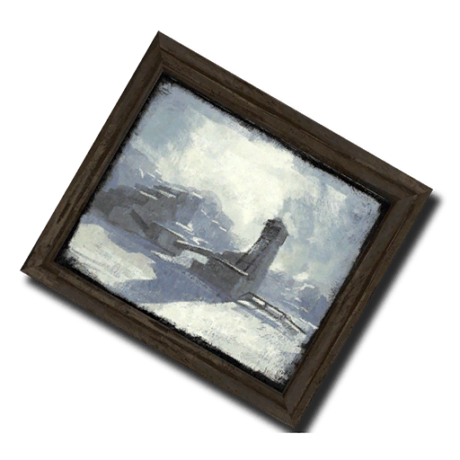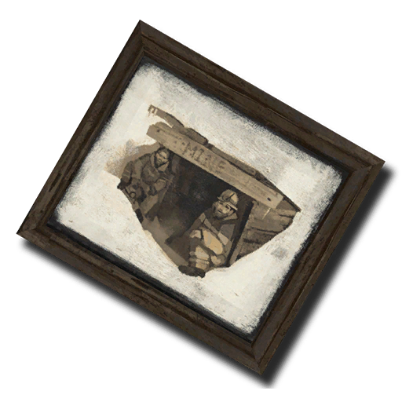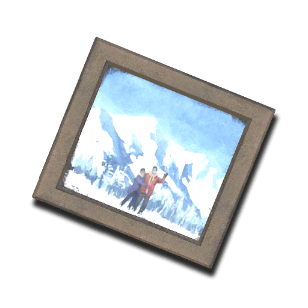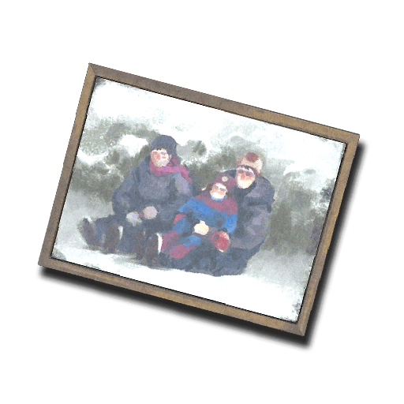

Frame (FT)

0.25 kg / _(0.55 lb)_

These are found in houses/buildings in the Far Territory. [Vacant Depot](./Vacant%20Depot.md), [Idle Camp](./Idle%20Camp.md), [Last Lonely House](./Last%20Lonely%20House.md), etc

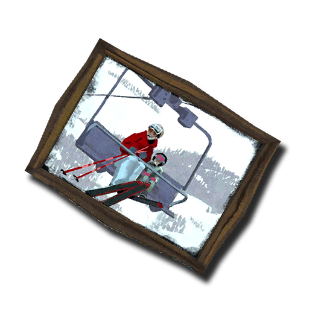

Frame (FT)

0.25 kg / _(0.55 lb)_

These are found in houses/buildings in the Far Territory. [Vacant Depot](./Vacant%20Depot.md), [Idle Camp](./Idle%20Camp.md), [Last Lonely House](./Last%20Lonely%20House.md), etc


Frame (Miner)

0.25 kg / _(0.55 lb)_

[Vacant Depot](./Vacant%20Depot.md), [Idle Camp](./Idle%20Camp.md), [Concentrator](./Concentrator.md) Offices

_DeskGlobe.png_

Globe

1.00 kg / _(2.2 lb)_

[Paradise Meadows Farm](./Paradise%20Meadows%20Farm.md), [Blackrock Prison](./Blackrock%20Prison.md) Warden's Office, [Main Hangar](./Main%20Hangar.md), [Bunker Alpha](./Bunker%20Alpha.md)

_HockeyStickA.png_

Hockey Stick

0.25 kg / _(0.55 lb)_

[Last Resort Cannery](./Last%20Resort%20Cannery.md) Trailer, [Island Cottage](./Island%20Cottage.md), [Basement (Sundered Pass)](./Basement%20%28Sundered%20Pass%29.md)

_WallHook.png_

Hook

0.10 kg / _(0.22 lb)_

Houses

_Horseshoe.png_

Horseshoe

0.10 kg / _(0.22 lb)_

[Hunting Lodge](./Hunting%20Lodge.md) Basement, [Blackrock Prison](./Blackrock%20Prison.md) Warden's Office

Kettle

0.25 kg / _(0.55 lb)_

[Last Resort Cannery](./Last%20Resort%20Cannery.md) Trailer, [Station Bunkhouse](./Station%20Bunkhouse.md), [Pensive Lookout](./Pensive%20Lookout.md)


_ComputerKeyboard.png_

Keyboard

0.20 kg / _(0.44 lb)_

Near Computers


_DialKnob.png_

Knob

0.25 kg / _(0.55 lb)_

[Concentrator](./Concentrator.md) (6th Floor, to the right of where the Woodworking Tools spawn in a machine), [Conveyor Room](./Conveyor%20Room.md) near the entrance to Langston Mine


Lamp

0.25 kg / _(0.55 lb)_

Green lamp found in [Blackrock Prison](./Blackrock%20Prison.md) Warden's Office Signal Void bunkers, Blackrock Prison (Infirmary), [Main Hangar](./Main%20Hangar.md)


Lamp

1.00 kg / _(2.2 lb)_

Houses


Lamp

2.00 kg / _(4.4 lb)_

Houses


[Lamp](./Metal%20Lamp.md)

5.00 kg / _(11 lb)_

Houses

_LightChristmas\_A.png_

Light

0.25 kg / _(0.55 lb)_

[Camp Office](./Camp%20Office.md), [Cannery Worker Residences](./Cannery%20Worker%20Residences.md), [Justy's Hovel](./Justy%27s%20Hovel.md)

Lid (Paintcan)

0.25 kg / _(0.55 lb)_

Sheds, Industrial Areas


_Lab\_Microscope.png_

Microscope

0.25 kg / _(0.55 lb)_

[Blackrock Prison](./Blackrock%20Prison.md) (Infirmary), [Bunker Alpha](./Bunker%20Alpha.md), [Bunker Beta](./Bunker%20Beta.md), [Bunker Gamma](./Bunker%20Gamma.md), [Bunker Omega](./Bunker%20Omega.md)

Mirror

3.00 kg / _(6.6 lb)_

[Hunting Lodge](./Hunting%20Lodge.md), [Vacant Depot](./Vacant%20Depot.md), [Bunker Omega](./Bunker%20Omega.md), [Foreman's Retreat](./Foreman%27s%20Retreat.md)

Monitor

4.00 kg / _(8.8 lb)_

Industrial Areas

_MooseMount\_A.png_

Moose Mount

5.00 kg / _(11 lb)_

[Community Hall](./Community%20Hall.md)

_ComputerMouse.png_

Mouse

0.05 kg / _(0.11 lb)_

Near Computers


Number

0.25 kg / _(0.55 lb)_

[Blackrock Prison](./Blackrock%20Prison.md) (inside the prison)

_ToasterOven.png_

[Oven](./Toaster.md)

1.00 kg / _(2.2 lb)_

Kitchens

_MicrowaveOven.png_

[Oven](./Microwave.md)

5.00 kg / _(11 lb)_

[Milton House](./Milton%20House.md) (only one microwave can be picked up)

Paintcan

0.25 kg / _(0.55 lb)_

Sheds, Industrial Areas

_PaintBrush.png_

Paintbrush

0.10 kg / _(0.22 lb)_

Sheds, Industrial Areas


Phone

0.25 kg / _(0.55 lb)_

Wall Phones - Industrial areas Office Phone - Offices

_Pillow\_Decoration.png_

Pillow

0.15 kg / _(0.33 lb)_

Trailers

_PitcherA.png_

Pitcher

0.25 kg / _(0.55 lb)_

Kitchens

Plant

5.00 kg / _(11 lb)_ 1.00 kg / _(2.2 lb)_

Houses

_MountainPosterDeco.png_

Poster

0.05 kg / _(0.11 lb)_

Houses

Poster

0.25 kg / _(0.55 lb)_

Houses

_CoatRackB.png_

Rack

0.20 kg / _(0.44 lb)_

Houses


Rack

0.30 kg / _(0.66 lb)_

Houses


Rack

0.50 kg / _(1.1 lb)_

Houses. Gun Rack - [Forestry Lookout](./Forestry%20Lookout.md), [Pensive Lookout](./Pensive%20Lookout.md), [Abandoned Lookout](./Abandoned%20Lookout.md), [Trapper's Homestead](./Trapper%27s%20Homestead.md), [Hunting Lodge](./Hunting%20Lodge.md), [Foreman's Retreat](./Foreman%27s%20Retreat.md)


_GunRackDouble.png_

Rack

0.75 kg / _(1.65 lb)_

Hunting Prepper Cache, [Last Lonely House](./Last%20Lonely%20House.md), [Milton House (Grey Mother's)](./Milton%20House%20%28Grey%20Mother%27s%29.md), [Last Resort Cannery](./Last%20Resort%20Cannery.md) (trailer)

Radio

0.10 kg / _(0.22 lb)_

House Bedrooms, [Bunker Alpha](./Bunker%20Alpha.md) [Blackrock Prison](./Blackrock%20Prison.md) (room with [Note (Survival 2)](./Note%20%28Survival%202%29.md) closest to the cells), [Control Tower](./Control%20Tower.md)

_Ico\_GearItem\_RadioA.png_

[Radio](./Radio.md)

2.00 kg / _(4.4 lb)_

Found in various buildings

_RakeA.png_

Rake

0.25 kg / _(0.55 lb)_

[Basement (Sundered Pass)](./Basement%20%28Sundered%20Pass%29.md), [Maintenance Yard](./Maintenance%20Yard.md)


Rug

1.00 kg / _(2.2 lb)_

Houses, Industrial Areas


Rug

2.00 kg / _(4.4 lb)_

Houses, Industrial Areas


Rug

5.00 kg / _(11 lb)_

Houses, Industrial Areas


_ToyRockingHorse.png_

Rocking Horse

3.00 kg / _(6.6 lb)_

[Milton House](./Milton%20House.md) (house close to Grey Mother's leading to [Radio Tower](./Radio%20Tower.md))


_GardenBoxShelf\_A.png_

Shelf (Corner)

5.00 kg / _(11 lb)_

[Idle Camp](./Idle%20Camp.md) mess hall kitchen, [Island Cottage](./Island%20Cottage.md)

Shelf

2.00 kg / _(4.4 lb)_

Houses

_BoneStagSkullC.png_

Skull

0.25 kg / _(0.55 lb)_

[Hunting Lodge](./Hunting%20Lodge.md), Hunting [Prepper Cache](./Prepper%20Cache.md), [Camp Office](./Camp%20Office.md), Found on Mounts in places with animal trophies

Skull

0.25 kg / _(0.55 lb)_

Hunting [Prepper Cache](./Prepper%20Cache.md)

Sign (Terminal)

0.10 kg / _(0.22 lb)_

[Terminal](./Terminal.md)

Sign (Depot)

0.25 kg / _(0.55 lb)_

[Vacant Depot](./Vacant%20Depot.md) (currently cannot take second one as it is outside)


Sign (Steam)

0.25 kg / _(0.55 lb)_

[Steam Tunnels](./Steam%20Tunnels.md) (currently cannot take these)


Sign (Small)

0.25 kg / _(0.55 lb)_

Industrial Areas


Sign (Mine)

0.25 kg / _(0.55 lb)_

Industrial Mine areas (Many of these are from the [Langston Mine](./Langston%20Mine.md), [Last Prospect](./Last%20Prospect.md), and [Cinder Hills Coal Mine](./Cinder%20Hills%20Coal%20Mine.md) middle level, which you cannot take)


Sign (Prison)

0.25 kg / _(0.55 lb)_

[Blackrock Prison](./Blackrock%20Prison.md) and Infirmary


Sign (Store)

0.25 kg / _(0.55 lb)_

[Convenience Store](./Convenience%20Store.md)

Sign (Store)

5.00 kg / _(11 lb)_

[Convenience Store](./Convenience%20Store.md)


Sign (Industrial)

0.25 kg / _(0.55 lb)_

Industrial Areas, [Carter Hydro Dam](./Carter%20Hydro%20Dam.md), [Concentrator](./Concentrator.md), [Conveyor Room](./Conveyor%20Room.md), [Headframe Building](./Headframe%20Building.md), [Maintenance Yard](./Maintenance%20Yard.md)


Sign (Refuge)

0.25 kg / _(0.55 lb)_

[Placid Notch](./Placid%20Notch.md), [Final Refuge](./Final%20Refuge.md), [Lotte's Rest](./Lotte%27s%20Rest.md) (currently cannot take lettered signs)


Sign (Poster)

0.25 kg / _(0.55 lb)_

[Maintenance Yard](./Maintenance%20Yard.md), [Terminal](./Terminal.md), [Main Hangar](./Main%20Hangar.md), [Carter Hydro Dam](./Carter%20Hydro%20Dam.md)

_WetFloorSign.png_

Sign (Wet)

0.25 kg / _(0.55 lb)_

Industrial/Commercial Bathrooms

_SoapA.png_

Soap

0.25 kg / _(0.55 lb)_

[Trapper's Homestead](./Trapper%27s%20Homestead.md), Bathrooms, [Bunker Omega](./Bunker%20Omega.md)


_StereoSpeaker.png_

Speaker

0.25 kg / _(0.55 lb)_

[Idle Camp](./Idle%20Camp.md), [Community Hall](./Community%20Hall.md), [Main Hangar](./Main%20Hangar.md)


_Electric\_Stovetop.png_

Stove

3.00 kg / _(6.6 lb)_

Trailers, [Paradise Meadows Farm](./Paradise%20Meadows%20Farm.md), [Last Resort Cannery](./Last%20Resort%20Cannery.md) Trailer


[Suitcase](./Suitcase.md)

0.25 kg / _(0.55 lb)_

[Terminal](./Terminal.md), [Concentrator](./Concentrator.md) (Offices), occasionally near bathrooms in houses


_ToyTeddyBearA.png_

Teddy Bear

0.25 kg / _(0.55 lb)_

[Milton House](./Milton%20House.md) (house close to Grey Mother's leading to [Radio Tower](./Radio%20Tower.md)), [Main Hangar](./Main%20Hangar.md), [Cabin (Sundered Pass)](./Cabin%20%28Sundered%20Pass%29.md), [Bunker Omega](./Bunker%20Omega.md), [Basement (Sundered Pass)](./Basement%20%28Sundered%20Pass%29.md)

Television

5.00 kg / _(11 lb)_

Homes, Industrial areas


_TimeCardPunchClock.png_

Time Clock

5.00 kg / _(11 lb)_

Industrial Areas

Tire

5.00 kg / _(11 lb)_

[Quonset Garage](./Quonset%20Garage.md), [Maintenance Yard](./Maintenance%20Yard.md), [Main Hangar](./Main%20Hangar.md), [Weather Station](./Weather%20Station.md)

_ToiletSeat\_A.png_

Toilet Seat

0.25 kg / _(0.55 lb)_

[Idle Camp](./Idle%20Camp.md)

_ToyTractor.png_

Tractor

0.25 kg / _(0.55 lb)_

[Milton House](./Milton%20House.md) (house close to Grey Mother's leading to [Radio Tower](./Radio%20Tower.md))


Trophy

0.25 kg / _(0.55 lb)_

[Milton House (Grey Mother's)](./Milton%20House%20%28Grey%20Mother%27s%29.md), [Paradise Meadows Farm](./Paradise%20Meadows%20Farm.md), [Blackrock Prison](./Blackrock%20Prison.md) Warden's Office, [Carter Hydro Dam](./Carter%20Hydro%20Dam.md) (admin office)

_WagonWheelB.png_

Wheel

2.00 kg / _(4.4 lb)_

[Hunting Lodge](./Hunting%20Lodge.md), [Camp Office](./Camp%20Office.md)


_Ico\_GearItem\_WagonWheelA.png_

Wheel

4.00 kg / _(8.8 lb)_

[Hunting Lodge](./Hunting%20Lodge.md), [Camp Office](./Camp%20Office.md), [Headframe Building](./Headframe%20Building.md)

Wooden Spoon

1.00 kg / _(2.2 lb)_

Kitchens


Unobtainable

These are icons of items currently outside of customization areas but can technically be picked up


Unknown

These items are in the game files but many either do not exist or cannot be pick up inside Customization zones.


_CashRegisterBank.png_

Cash Machine

5.00 kg / _(11 lb)_

Cash Machine has been removed from [Milton Credit Union](./Milton%20Credit%20Union.md)

_BoneHumanSkullA.png_

Skull

0.25 kg / _(0.55 lb)_

Skull has been removed from [Bunker Omega](./Bunker%20Omega.md) ([Dr. Rüdiger](./Dr.%20R%C3%BCdiger.md)'s skull is now a skeleton that can be destroyed)

**Name:** Location

_Bandsaw.jpg_

Bandsaw

[Bunker Omega](./Bunker%20Omega.md)

_Metal\_Barrel.jpg_

Barrel (Metal)

Industrial Areas


_Bin.jpg_

Bin

[Idle Camp](./Idle%20Camp.md), [Last Lonely House](./Last%20Lonely%20House.md), [Cabin (Sundered Pass)](./Cabin%20%28Sundered%20Pass%29.md)

_Blackboard.jpg_

Blackboard

[Signal Void](./Signal%20Void.md) bunkers, [Station Bunkhouse](./Station%20Bunkhouse.md)


Blinds

House/cabin/kitchen/office windows


_BulletinBoardD.png_

Board

[Pensive Lookout](./Pensive%20Lookout.md)

_Brick.jpg_

Brick

[Hibernia Processing](./Hibernia%20Processing.md), [Concentrator](./Concentrator.md)

_Bricks.jpg_

Bricks

[Hibernia Processing](./Hibernia%20Processing.md), [Concentrator](./Concentrator.md), [Last Resort Cannery](./Last%20Resort%20Cannery.md)


_Candy\_Machine.jpg_

Candy Machine

[Milton Post Office](./Milton%20Post%20Office.md), [Convenience Store](./Convenience%20Store.md), [Milton Credit Union](./Milton%20Credit%20Union.md)

_Canister.jpg_

Canister (Garbage Can)

Bathrooms, [Terminal](./Terminal.md), [Milton Credit Union](./Milton%20Credit%20Union.md), [Milton Post Office](./Milton%20Post%20Office.md), [Last Resort Cannery](./Last%20Resort%20Cannery.md) Trailer

_Case.jpg_

Case

[Convenience Store](./Convenience%20Store.md)


_Cash\_Machine.jpg_

Cash Machine (ATM)

[Terminal](./Terminal.md), [Rural Store](./Rural%20Store.md), [Convenience Store](./Convenience%20Store.md), [Milton Credit Union](./Milton%20Credit%20Union.md), [Concentrator](./Concentrator.md) Offices


_Clipboard.jpg_

Clipboard

Industrial Areas

**Clock (Grandfather):** [Milton House (Grey Mother's)](./Milton%20House%20%28Grey%20Mother%27s%29.md), [Hunting Lodge](./Hunting%20Lodge.md)

_Coat\_Stand.jpg_

Coat Stand

[Blackrock Prison](./Blackrock%20Prison.md) Warden's Office, [Main Hangar](./Main%20Hangar.md)

**Counter:** [Hunting Lodge](./Hunting%20Lodge.md), [Carter Hydro Dam](./Carter%20Hydro%20Dam.md)

Curtain (Curtain/Towel rack)

Bathrooms

_Cups.jpg_

Cups

[Convenience Store](./Convenience%20Store.md)

_Debris.jpg_

Debris

Rubble - [Concentrator](./Concentrator.md), [Blackrock Prison](./Blackrock%20Prison.md) (inside prison) Ceiling Tiles - [Convenience Store](./Convenience%20Store.md), [Milton Credit Union](./Milton%20Credit%20Union.md)

_Door\_destroyable.jpg_

Door

[Hibernia Processing](./Hibernia%20Processing.md), [Concentrator](./Concentrator.md)


_PictureFrameLong.png_

Frame

[Vacant Depot](./Vacant%20Depot.md)


_Fire\_Poker.jpg_

Fire Poker

[Mindful Cabin](./Mindful%20Cabin.md), [Cabin (Sundered Pass)](./Cabin%20%28Sundered%20Pass%29.md), [Island Cottage](./Island%20Cottage.md)

_Hand\_Truck.jpg_

Hand Truck

Industrial Areas

_Hand\_Truck\_2.jpg_

Hand Truck

Industrial Areas

_Lamp\_broken.jpg_

Lamp (Broken)

Light


_Light\_Rack.jpg_

Light

[Paradise Meadows Farm](./Paradise%20Meadows%20Farm.md)

**Hangar:** Homes

_Glasses.jpg_

Glasses

[Concentrator](./Concentrator.md) Office, [Island Cottage](./Island%20Cottage.md)

**Map:** [Pensive Lookout](./Pensive%20Lookout.md) (map of Coastal Highway on the Board)

_Metal\_Sheet.jpg_

Metal (Sheet)

Industrial Areas

Mirror (Broken)

Bathrooms (most mirrors like this are shattered)

_Mount.jpg_

Mount

[Hunting Lodge](./Hunting%20Lodge.md), Hunting [Prepper Cache](./Prepper%20Cache.md), Places with animal trophies


_Organ.jpg_

Organ

[St. Christopher's Church](./St.%20Christopher%27s%20Church.md), [Pleasant Valley Church](./Pleasant%20Valley%20Church.md)


Plate

Kitchens

**Podium:** [St. Christopher's Church](./St.%20Christopher%27s%20Church.md), [Pleasant Valley Church](./Pleasant%20Valley%20Church.md), [Community Hall](./Community%20Hall.md)

**Piano:** [Community Hall](./Community%20Hall.md)

_Pipes.jpg_

Pipe (Bundle)

Industrial Areas

**Rack:** Houses

_Slush\_Machine.jpg_

Slush Machine

[Convenience Store](./Convenience%20Store.md)


_Soda\_Machine.jpg_

Soda Machine

[Convenience Store](./Convenience%20Store.md)


_Stereo.jpg_

Stereo

Near Speakers, [Paradise Meadows Farm](./Paradise%20Meadows%20Farm.md)

_Storage.jpg_

Storage

Offices

_Tank.jpg_

Tank

Industrial Areas

_Tire\_Rack.jpg_

Tire Rack

[Quonset Garage](./Quonset%20Garage.md), [Maintenance Yard](./Maintenance%20Yard.md), [Main Hangar](./Main%20Hangar.md)

_Tray.jpg_

Tray

[Idle Camp](./Idle%20Camp.md)


_Traffic\_Cone.jpg_

Cone (stand)

[Main Hangar](./Main%20Hangar.md)


_Trough.jpg_

Trough

Industrial Areas, [Maintenance Yard](./Maintenance%20Yard.md), [Hunting Lodge](./Hunting%20Lodge.md), [Mindful Cabin](./Mindful%20Cabin.md)

_Vending\_Machine.jpg_

Vending Machine

[Milton Park](./Milton%20Park.md), [Convenience Store](./Convenience%20Store.md), [Concentrator](./Concentrator.md) Offices, [Terminal](./Terminal.md)

_Wheelbarrow.jpg_

Wheelbarrow

Sheds, Industrial Buildings
